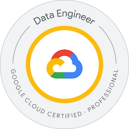

<h1 align="center">Ingrid da Silva</h1>

  <strong>Data Engineer | Google Cloud Certified Professional Data Engineer</strong>

  
    

    I design and build cloud-native data platforms that power reliable analytical systems. My work spans scalable data infrastructure, distributed data processing, modern ELT architectures, and analytics engineering on Google Cloud. I am interested in advancing data engineering and AI for genomics, bioinformatics, and scientific computing.
    

## Expertise

**Architecture**
`Cloud-native Data Platforms` `Distributed Data Processing` `Scalable Data Infrastructure` `Lakehouse Architecture` `Big Data`

**Data Engineering**
`ETL/ELT` `Data Pipelines` `Batch Processing` `Analytics Engineering` `Data Modeling` `Data Warehousing`

**Cloud & AI**
`Google Cloud` `BigQuery` `Vertex AI` `Generative AI`

**Programming**
`Python` `SQL`

**Infrastructure**
`Apache Airflow` `Apache Spark` `Docker` `Terraform` `CI/CD`

## Featured Projects

### [HELIOX — End-to-End Genomic Data Platform](https://github.com/ingridevv/genomic-disease-risk-pipeline)

End-to-end genomic data platform for processing and analyzing more than **1.1 million GWAS variants** through reproducible cloud-native data pipelines and infrastructure automation.

**Technologies:** `dbt` • `Snowflake` • `Python` • `Apache Airflow` •`Docker` • `Terraform` • `GitHub Actions` 

---

## Certifications

* Google Cloud Certified Professional Data Engineer
* AWS Developer – Associate
* Oracle AI Foundations Associate
* AWS Certified Cloud Practitioner

## Connect

---
